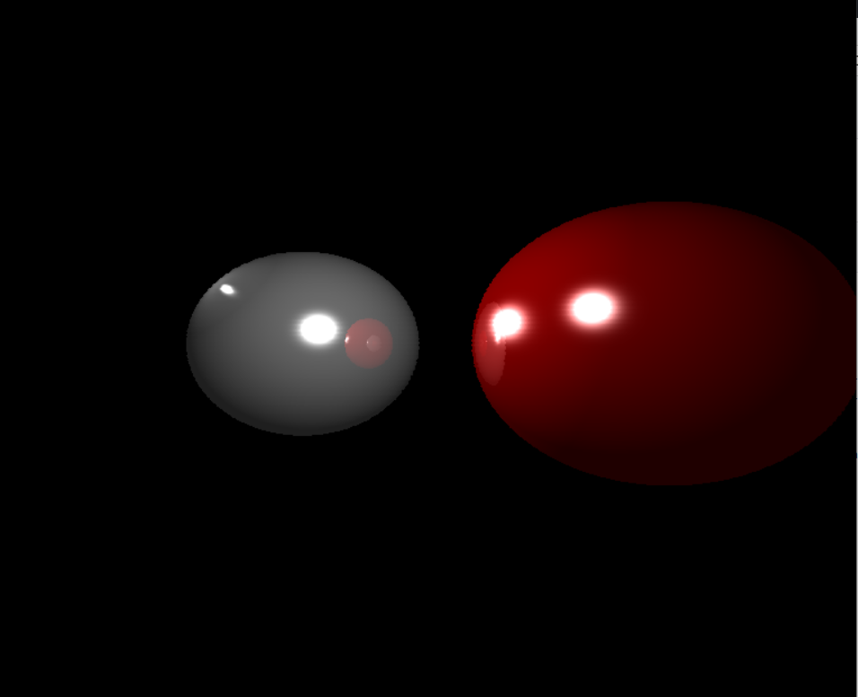
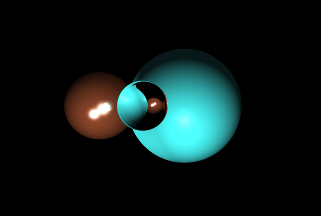
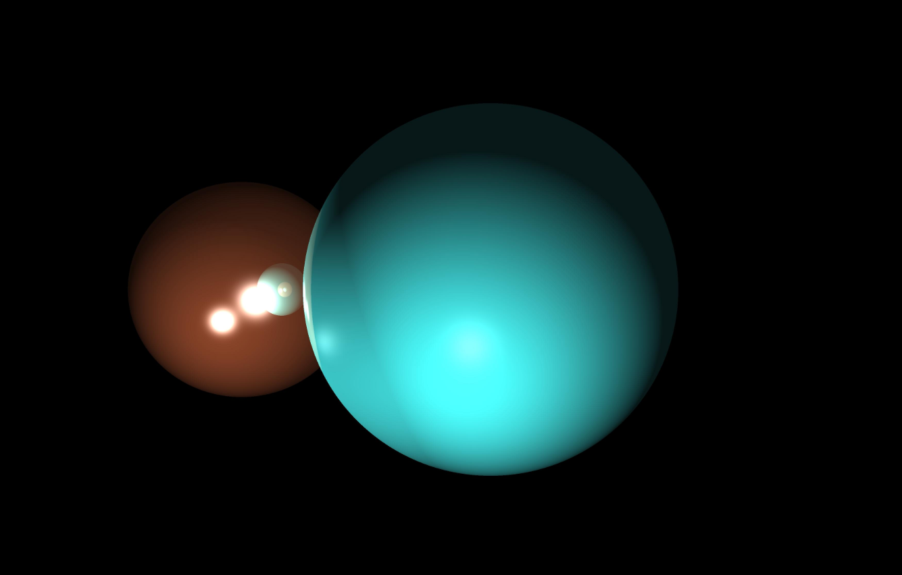

# CPU-RayTracer
Two implementations of a CPU ray tracer, one in C++ one in Golang

# Description and Output
These are two implementations of the ray tracing algorithm. The original C++ version was created for a computer graphics class and reads scene data from input files, is able to display triangle meshes read from obj files, and receives keyboard input for changing things like resolution or the size and distance of the virtual image plane. Here is an example output with 2 spheres at 1024x1024 resolution with trace depth of 5:

The Go version I wrote as a side project in large part because I like writing Go code. The C++ version, as it was a class assignment, is a bit hacky and doesn't fit the standard of code I'd usually like to write. The Go version was an attempt at writing idiomatic code that was better organized and more logical than the C++ version. The Go version only supports spheres and does not read from an input file. It does, however, give faster render times and has much better useability. Here are 2 examples of output from the Go version:

1. Two opaque spheres and a completely transparent sphere with a 4096x4096 resolution and trace depth of 5 :

2. Two opaque spheres (similar to the C++ version above)

# Optimization
One of other goals when writing the Go version was to get the opportunity to implement Go's somewhat unique form of parallelization, Goroutines, for the first time. Ray tracing is an algorithm that easily benefits from parallelization, by having different threads do the computations for different rays. Here are some of the runtime benchmarks:
<pre>
C++ | 1024x1024 | C++ Scene 1: 5.33 seconds 
C++ | 4096x4096 | C++ Scene 1: 85.7 seconds 

Go w/ Goroutines    | 1024x1024 | Go Scene 2: 0.66 seconds 
Go w/out Goroutines | 1024x1024 | Go Scene 2: 1.46 seconds 

Go w/ Goroutines    | 4096x4096 | Go Scene 2: 12.6 seconds 
Go w/out Goroutines | 4096x4096 | Go Scene 2: 22.7 seconds 

Go w/ Goroutines    | 4096x4096 | Go Scene 1: 12.7 seconds 
Go w/out Goroutines | 4096x4096 | Go Scene 1: 31.6 seconds 
</pre>
As can be seen, the Go version is significantly faster than the C++ version. This could be due to the fact that the C++ version also attempts to perform intersection calculations on triangles as well as spheres. The Go version with goroutines significantly improves the running time of the algorithm, with the best improvement being 60% faster on the 4096x4096 render of scene 2. 

# Future 
In the future, I'd like to clean up the C++ code, and create a multithreaded version of that program as well to see how the improvements compare. I'd also like to expand upon the Go version to support reading of generic obj files. And in the long term, I would like to make the Go version available as a web service, making use of Go's pretty easy to use standard REST API library. This would allow  users to request ray traced images of scenes through a webpage. With the 1024x1024 resolution images with parallelization returning results in under 1 second, I think it would be a good way for users to quickly see examples of ray traced images, as well as test out how different parameters affect the output.

